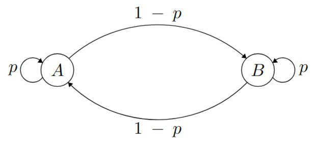

# Markovian Mirror Prox Experiment

## Objective Operator

In this experiment, we are solving the saddle-point problem

$$\min\limits_{x \in \Delta_{d-1}} \max\limits_{y \in \Delta_{d-1}} f(x, y),$$

where

$$f(x, y) := x^T A y + b^T x + c^T y,$$
$$A \in \mathbb{R}^{d \times d}, \, b \in \mathbb{R}^d, \, c \in \mathbb{R}^d.$$

Matrix $A$ is randomly generated. We also generate solutions from the simplex $x^\*, y_\*$ and take $b = -Ay^\*$ and $c = -A^T x^\*$

For this problem, the operator has the following form:

$$F(z) := (\nabla_x f(x, y), - \nabla_y f(x, y))^T =  (Ay + b, -A^Tx - c)^T$$

## Setup

In the numerical experiments, we consider the problem described above on the different ergodic Markov chains. In order to compare the outcomes properly, we let all the Markov chains have the similar structure:

 

Here $p$ is a unique parameter of the Markov chain, arrows denote the transitions, and $A$ and $B$ represent the states. Each state implies a unique current distribution that generates the noise. In our experiments, we assume that both of the states have a normal distribution, in particular, state $A$ generates a value from the distribution $\mathcal{N}(0.1, \sigma^2)$, state $B$ generates a value from $\mathcal{N}(-0.1, \sigma^2)$, where $\sigma$ is a varying parameter for deeper study. The generated noise $\xi$ is considered to be additive:
$$\left[F(z, \xi)\right]_i := \left[F(z)\right]_i + \xi_i.$$

## Methods

In our experiments we consider the same setup as in the main experimnt of the paper: Euclidean, Softmax and Bregman projections.

## Results

## Discussion

TODO
