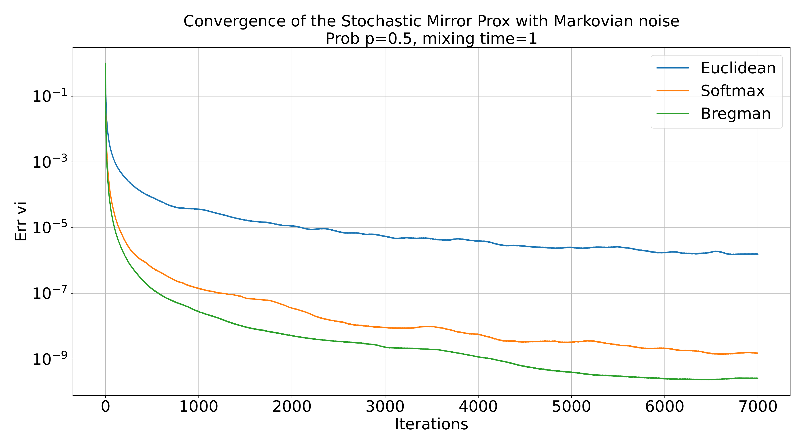
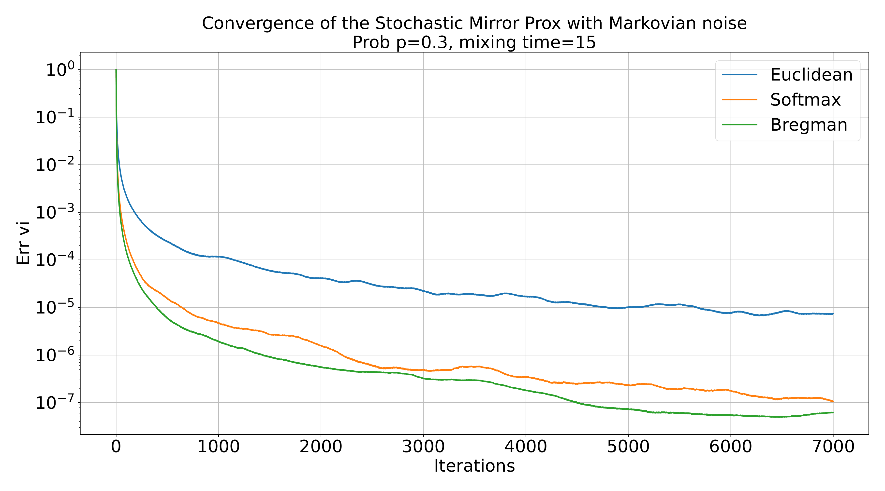

# Markovian Mirror Prox Experiment

## Objective Operator

In this experiment, we are solving the saddle-point problem

$$\min\limits_{x \in \Delta_{d-1}} \max\limits_{y \in \Delta_{d-1}} f(x, y),$$

where

$$f(x, y) := x^T A y + b^T x + c^T y,$$
$$A \in \mathbb{R}^{d \times d}, b \in \mathbb{R}^d, c \in \mathbb{R}^d.$$

Matrix $A$ is randomly generated. We also generate solutions from the simplex $x_{sol}, y_{sol}$ and take $b = -Ay_{sol}$ and $c = -A^T x_{sol}$

For this problem, the operator has the following form:

$$F(z) := (\nabla_x f(x, y), - \nabla_y f(x, y))^T =  (Ay + b, -A^Tx - c)^T .$$

## Setup

In the numerical experiments, we consider the problem described above on the different ergodic Markov chains. In order to compare the outcomes properly, we let all the Markov chains have the similar structure:

 

Here $p$ is a unique parameter of the Markov chain, arrows denote the transitions, and $A$ and $B$ represent the states. Each state implies a unique current distribution that generates the noise. In our experiments, we assume that both of the states have a normal distribution, in particular, state $A$ generates a value from the distribution $\mathcal{N}(\mu, \sigma^2)$, state $B$ generates a value from $\mathcal{N}(-\mu, \sigma^2)$. For now, we the parameters of noise are constant: $\mu = 0.1, \sigma^2 = 0.01$. The generated noise $\xi$ is considered to be additive:
$$[F(z, \xi)]_i := [F(z)]_i + \xi_i.$$

## Methods

In our additional experiments, we consider Algorithm 3 with three different projections: Bregman, Euclidean and Softmax. The purpose of this experiment is to investigate the effect of the mixing time parameter on the convergence rate. The results with different mixing times are presented below.

## Results

## Discussion

This experiments again confirm the fact that the method with Bregman projection outperforms the softmax and Euclidean projections, especially for bit values of $\tau_{\text{mix}}$.
